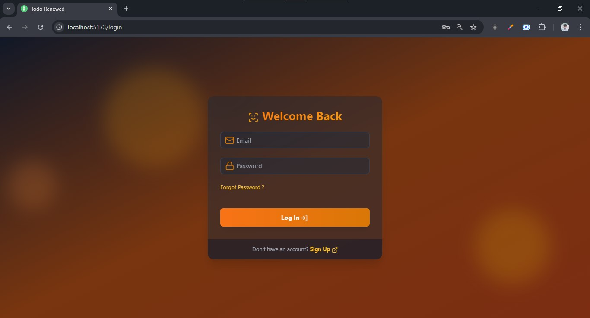

# Todo_Renewed

## Table of Contents

1. [Overview](#overview)
2. [Installation](#installation)
3. [Features](#features)
4. [Technologies](#technologies)
5. [Dependencies](#dependencies)
6. [Folder Structure](#folder-structure)
7. [Screenshots](#screenshots)
8. [Contributing](#contributing)
9. [FAQ](#faq)
10. [License](#license)
11. [Contact](#contact)

## Overview

> This is a simple todo app that I created to learn the MERN stack. The app is connected to a MongoDB database and the user can access their todos from any device. The app also has a user authentication system. The user can sign up, sign in, sign out, reset password, and verify their email.

## Installation

1. Clone the repository
2. Run `npm install` in the root directory
3. Run `npm install` in the frontend directory
4. Run `npm run dev` in the root directory to start the development server
5. Run `npm run start` in the frontend directory to start the frontend server
6. Open `http://localhost:5173` in your browser

<marquee style="color:red; font-weight:600">Setup Your [.env](https://github.com/soumya3969/Todo_Renewed/blob/main/env.sample.md) file before running </marquee>

## Features

> As the name suggests, this is a todo app. The following features are available:

1. Add a todo
2. Edit a todo
3. Delete a todo
4. View a todo
5. View all todos
6. Mark a todo as completed

> The app also has a user authentication system. The following features are available:

1. Sign up
2. Sign in
3. Sign out
4. Reset password
5. Forgot password
6. Email verification

> As the App is connected to a MongoDB database, all the data is stored in the database. User can access their todos from any device.

## Technologies

1. `MongoDB`
2. `Express`
3. `React`
4. `Node.js`

## Dependencies

> Frontend

    1. Zustand
    2. Axios
    3. Framer Motion
    4. Lucide React
    5. React Router
    6. Vite
    7. ESLint
    8. React-hot-toast

> Backend

    1. Bcryptjs
    2. Cookie-parser
    3. Cors
    4. Cross-env
    5. Crypto
    6. Dotenv
    7. Express
    8. Jsonwebtoken
    9. Mongoose
    10. Nodemon

## Folder Structure

```
.
└── Todo_Renewed/
    ├── backend/
    │   ├── controllers/
    │   │   ├── auth.controller.js
    │   │   └── todo.controller.js
    │   ├── db/
    │   │   └── connectDB.js
    │   ├── mails/
    │   │   ├── emails.js
    │   │   ├── emailTemplates.js
    │   │   └── gmail.config.js
    │   ├── middleware/
    │   │   └── verifyToken.js
    │   ├── models/
    │   │   ├── todo.model.js
    │   │   └── user.model.js
    │   ├── routes/
    │   │   └── todo.routes.js
    │   ├── utils/
    │   │   └── generateTokenAndSetCookie.js
    │   └── index.js
    ├── frontend/
    │   ├── node_modules/
    │   ├── public/
    │   ├── src/
    │   │   ├── components/
    │   │   │   ├── FloatingShape.jsx
    │   │   │   ├── Input.jsx
    │   │   │   ├── LoadingSpinner.jsx
    │   │   │   ├── Navbar.jsx
    │   │   │   ├── PasswordStrengthMeter.jsx
    │   │   │   └── TextArea.jsx
    │   │   ├── Pages/
    │   │   │   ├── DashboardPage.jsx
    │   │   │   ├── EmailVerificationPage.jsx
    │   │   │   ├── ForgotPasswordPage.jsx
    │   │   │   ├── LoginPage.jsx
    │   │   │   ├── ResetPasswordPage.jsx
    │   │   │   ├── SignupPage.jsx
    │   │   │   └── TodoPage.jsx
    │   │   ├── Store/
    │   │   │   ├── authStore.js
    │   │   │   └── todoStore.js
    │   │   ├── utils/
    │   │   │   └── date.js
    │   │   ├── App.jsx
    │   │   ├── index.css
    │   │   └── main.jsx
    │   ├── .gitignore
    │   ├── eslint.config.js
    │   ├── index.html
    │   ├── package-lock.json
    │   ├── package.json
    │   ├── postcss.config.js
    │   ├── Readme.md
    │   ├── tailwind.config.js
    │   └── vite.config.js
    ├── node_modules
    ├── .env
    ├── .gitignore
    ├── package.json
    └── readme.md
```

## Screenshots





## Contributing

- If you would like to contribute to this project, please fork the repository and create a pull request.
- You can also open an issue if you find any bugs or have any suggestions.

## FAQ

- Q: What is the purpose of this project?

  - A: This project is a simple todo app that I created to learn the MERN stack.

- Q: Is this project open source?
  - A: Yes, this project is open source. You can find the code on [GitHub](https://github.com/soumya3969/Todo_Renewed).

## License

This project is licensed under the MIT License. For more information, please refer to the [LICENSE file](LICENSE).

## Contact

If you have any questions or feedback, please contact me at [https://github.com/soumya3969](https://github.com/soumya3969). <br>
You can also reach me via email at [srmhnt2001@gmail.com](mailto:srmhnt2001@gmail.com).
